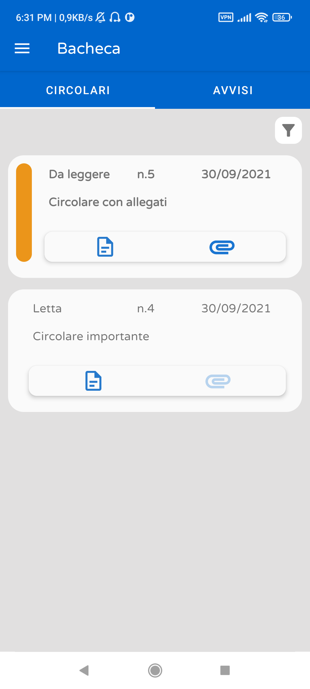

# Giua-App

  
  
  
  

  

# Attenzione!
***Questo progetto non riceve più aggiornamenti ed è stato abbandonato***

## Alternative a Giua-App

#### Per le scuole
Vi consigliamo di configurare dal registro le notifiche tramite Telegram, [maggiori informazioni nella documentazione.](https://iisgiua.github.io/giuaschool-docs/task-notifier.html)

#### Per gli Studenti/Genitori
Chiedete alla vostra scuola di attivare le notifiche tramite Telegram, se già presenti seguite le istruzioni sul vostro registro.

---

Vecchio README:
> ## Che cos'è?
> Giua-App è una applicazione per Android che permette di visualizzare voti, assenze, lezioni e tutte le altre informazioni ottenibili da un sito con il registro > elettronico [giua@school](https://github.com/trinko/giuaschool#giuaschool).
> Questa app usa la libreria [Giua-Webscraper](https://github.com/Giua-app/Giua-Webscraper) per ottenere le informazioni dal sito

> 

> oppure scarica manualmente dal sito https://giua-app.github.io

> 
> 
> 
> 
> 
> 
> 
> 
> 
> 
> 

> ## Features

> ### Login
> - Puoi accedere al registro con le tue credenziali, sia genitore che studente
> - Puoi decidere se memorizzare le credenziali oppure no
> ### Voti
> - Guarda tutti i tuoi voti in un unico posto, divisi per materia e quadrimestre
> - Leggi gli argomenti e giudizi dei tuoi voti
> - L'app ti mostrerà la media matematica delle tue materie
> ### Agenda
> - Controlla i compiti e le verifiche per i prossimi giorni
> - L'app ti dirà quanti giorni mancano alla consegna del compito o verifica
> - Leggi gli argomenti dei compiti e il professore che gli ha inseriti
> - L'app ti invierà una notifica per nuovi compiti e verifiche (può ritardare fino a un'ora)
> ### Lezioni
> - Guarda gli argomenti e attività svolte a lezione
> - Guarda la materia e l'orario della lezione
> ### Bacheca
> - Controlla le nuovi circolari da leggere
> - Guarda i nuovi avvisi
> - Controlla quali circolari o avvisi hai gia letto oppure no
> - Guarda la tipologia degli avvisi e chi l'ha creato
> - L'app ti invierà una notifica per nuove circolari e avvisi (può ritardare fino a un'ora)
> ### Pagella
> - Controlla l'esito finale degli scrutini 
> - Controlla i tuoi crediti
> ### Altro
> - La prima volta che avvii l'app, essa ti mostrerà un riassunto delle funzioni e il loro utilizzo attraverso slide (è possibile rivederlo dalle impostazioni)
> - L'app supporta anche gli studenti con il login Google
> - L'app può notificare in caso di nuovi aggiornamenti e installarli a seconda delle preferenze dell'utente
> - L'utente può disabilitare le notifiche dalle Impostazioni

> ## Come si scarica?
> Il sito https://giua-app.github.io ti darà sempre l'ultima versione dell'app

> In alternativa puoi andare sulle [Release](https://github.com/Giua-app/Giua-App/releases)

> ## Contatti
> Puoi contattarci creando una [Issue](https://github.com/Giua-app/Giua-App/issues) qui su GitHub oppure via email all'indirizzo [contact@appgiua.slmail.me](mailto:contact@appgiua.slmail.me)

